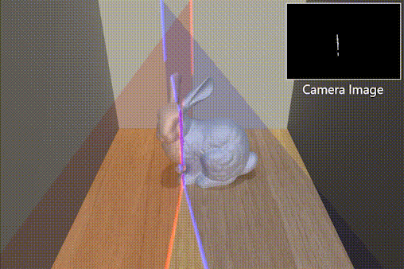

# Light Curtain Simulator
**Code for simulating programmable light curtains.**



## Installation

#### 1. Clone repository.
```bash
git clone --recursive git@github.com:CMU-Light-Curtains/Simulator.git
cd Simulator
```

#### 2. Build repository.
```bash
mkdir build && cd build
ANACONDA_ENV_PATH=/path/to/anaconda/env
cmake -DCMAKE_BUILD_TYPE=Release \
      -DPYTHON_EXECUTABLE:FILEPATH=$ANACONDA_ENV_PATH/bin/python \
      -DPYTHON_LIBRARY=$ANACONDA_ENV_PATH/lib/libpython3.so \
      -DPYTHON_INCLUDE_DIR=$ANACONDA_ENV_PATH/include/python3.7m ..
make -j
cd ..
```

#### 3. Run the demo to ensure that the installation works.
```bash
cd python
python lc_sim.py
```
